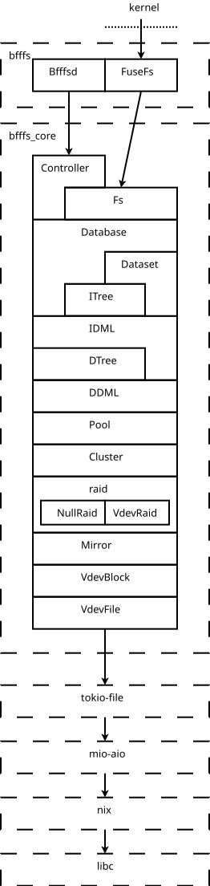

BFFFS Implementation
====================

---
author: Alan Somers <asomers@gmail.com>
---

Crates
------

The BFFFS contains four separate crates:

* **bfffs** - The main crate, which contains the `bfffsd` and `bfffs` binaries,
  and all of the FUSE-related code.

* **bfffs-core** - This crate contains the guts of BFFFS.  It lives in a
  separate crate so that it may be consumed by either a userspace or
  kernelspace implementation.  Everything in this crate should is intended to
  be built for either userspace or kernelspace.

* **bfffs-fio** - This is an internal benchmarking tool.  It builds
  `bfffs-core` as a fio backend.  That lets us run fio against BFFFS while
  excluding the overhead of FUSE.

* **isa-l** - This is bindings for Intel's ISA-L.  The bindings aren't general,
  but are limited to only what BFFFS's RAID module needs.  It should probably
  be renamed to `bfffs-isa-l`.

* **bfffs-kmod** - This crate doesn't exist yet!  But it might some day.  Its
  hypothetical existence is the reason for splitting `bfffs` and `bfffs-core`
  apart.

Layers
------

BFFFS is divided into a hierarchy of many small layers.  The division
facilities testing (see below), and isolates concerns.  Here is a slightly
simplified stack showing the layers involved in I/O operations like read and
write.

From top to bottom, these layers are:

* **Bfffsd** - The server process that does everything.  It listens on a socket
  for user operations coming from `/bin/bfffs`.  It is also responsible for
  creating `FuseFs` objects and mounting them.  This object, and its binary,
  are built from the `bfffs` crate.

* **FuseFs** - An object containing a mounted FUSE file system.  Once created,
  it no longer interacts with the main `Bfffsd` object.  All I/O comes from the
  kernel using FUSE's usual upcalls.  This object is built from the `bfffs`
  crate, when the `fuse` feature is active.

* **Controller** - The entry point to the `bfffs_core` crate.  This object is
  responsible for control-path operations like file system creation and
  deletion, as well as mounting.

* **Fs** - An object containing a file system, which may or may not be mounted
  by the operating system.  Its API is similar to the API of FUSE file systems,
  containing methods for write, read, etc.

* **Database** - This object owns all file systems.  But its most crucial
  responsibility is to manage the pool's transactions.  It is the `Database`
  that opens, closes, and syncs new transactions.

* **Dataset** - A sort of temporary handle to the lower layers of the stack,
  but (if writes are allowed) limited to a single transaction.  Unlike the
  `Database`, a `Dataset` is used for data-path operations only, not
  control-path operations.

* **ITree** - A copy-on-write B+Tree that uses indirect addresses for its
  on-disk data structures.  An indirect address is one that permits the
  underlying storage to be physically moved without requiring the tree to be
  rewritten.  On-disk, all file system data and most metadata is stored in an
  `ITree`.

* **IDML** - The Indirect Data Management Layer.  This layer has a
  record-oriented interface, with operations like `get`, `put`, and `delete`
  that operate on whole records at a time.  Notabily, the `put` method does not
  take an address as an argument.  Rather, it returns the address where the
  data was written.  At this layer, all operations are indirect, allowing the
  `IDML` to relocate some of its own records.

* **DTree** - A copy-on-write B+Tree that uses direct addresses for its on-disk
  data structures.  On-disk, a `DTree` is used to store the actual physical
  location of indirect records.  Moving a node of the `DTree` is more difficult
  than moving a node of the `ITree`.  But it's possible and tractable, because
  direct records must always have exactly one reference.

* **DDML** - The Direct Data Management Layer.  Just like the `IDML`, but for
  direct records.  Note that even though all file system data is stored in
  direct records, file system operations must still go through the `DDML`,
  because every indirect record points to a direct one.

* **Pool** - A BFFFS storage pool.  In its composition, it's exactly analogous
  to a ZFS storage pool.  It stripes data across one or more `cluster`.  Reads
  are block-oriented.  The client requests to read a contiguous portion of data
  from a given address, in lengths that must be a multiple of the block size.
  But writes, at this layer, still do not know their addresses.  The client
  provides the data to write, and the `Pool` returns the address at which it
  was written.

* **Cluster** - This object owns a single RAID vdev.  Its main responsibility
  is to allocate storage for writes.  Like the `Pool`, the client provides the
  data to write.  But the `Cluster` itself determines the address.

* **raid** - This layer handles RAID arrays.  Unlike at the `Cluster`, writes
  here must already have known addresses.  This layer contains two specialized
  implementations: `NullRaid` handles the common case when no kind of RAID
  parity is in use.  It's used for pools that contain only a single disk, or
  striped disks, or mirrored disks.  The `VdevRaid` implementation, on the
  other hand, does the actual work for read RAID arrays.

* **Mirror** - This layer handles mirroring.  In order to support the needs of
  the `raid` layer, `Mirror` supports vectored read and write operations;
  higher layers do not.

* **VdevBlock** - This layer's main responsibility is to schedule I/O
  operations for a single disk.  It can juggle multiple queued operations
  in-flight at any one time, reording them if necessary.

* **VdevLeaf** - This rather simple layer encapsulates a single disk-like
  storage device.  Unlike `VdevBlock`, I/O requests here are dispatched to the
  underlying storage immediately.  Most of the logic here involves emulating
  Zones, if the underlying disk doesn't natively have them.

* **tokio-file** - This is an external crate, even though it was written
  explicitly to support BFFFS.  It provides bindings to use POSIX AIO with
  Tokio.  Tokio is the reactor framework used by BFFFS and many other Rust
  programs.

* **mio-aio** - This is also an external crate, even though it was written
  explicitly to support `tokio-file`.  It provides bindings to use POSIX AIO
  with mio.

* **nix** - This external crate provides a Rust-friendly API for many `libc`
  functions.  BFFFS uses many modules from `nix`.  Most importantly, all of
  BFFFS's disk I/O goes through `nix`'s POSIX AIO module.  That module was
  written to support BFFFS.

* **libc** - This external crate is the lowest layer of the Rust code.  It
  simply contains FFI definitions for the operating system's C library, for use
  by crates like `nix`.

Additional Modules
------------------

`bfffs-core` also contains several other modules that don't neatly fit into the
above I/O stack.  A few of these are:

* **Manager** -  Unlike ZFS, BFFFS owns disks that aren't yet part of any
  imported `Pool`.  There is a whole stack of `Manager` structures, in every
  layer from `Database` to `VdevBlock`, to manage these inactive disks.

* **Tree** - BFFFS contains B+Trees of two types, direct and indirect, at two
  different layers of the stack.  Those two types of trees share almost all of
  their code, in the form of the generic `Tree` structure.

* **Cache** - BFFFS's cache is considerably simpler than ZFS's ARC.  Not
  because it uses the LRU algorithm instead of ARC (which may change in the
  future), but because it is purely a read-cache.  There is no dirty data here.
  Both the `IDML` and `DDML` can access the cache.

* **Writeback** - BFFFS caches dirty data in a wholly separate object: the
  `Writeback`.  It's owned by the `IDML`.  Dirty data can be cached here
  temporarily before the `IDML` flushes it.

* **rpc** - This module contains definitions for the datatypes used for
  communication between the `bfffsd` and `bfffs` binaries.  It resides in
  `bfffs_core` rather than `bfffs`, even though it isn't consumed by anything
  in `bfffs_core`, because it might need to be consumed by a future kernel
  module.

Testing strategy
----------------

BFFFS relies on four types of tests.  All functionality must be tested by at
least one, whichever is most appropriate, but more is better.

* **Unit tests** - These live in the ``src`` directory and target one layer
  only.  Each layer's unit tests operate on a mock version of the lower layer.
  For example, the unit tests for ``Pool`` use a ``MockCluster`` instead of a
  real ``Cluster``.  Unit tests are therefore the fastest and most reliable
  type of test, but have relatively high maintenance (because they access
  private implementation details), and don't always reflect realistic usage.
  They are also useful for injecting error conditions that can't be tested any
  other way.

* **Functional tests** - These live in the ``tests`` directory. Each functional
  test module targets one layer, but operates on a full stack, up to the layer
  of interest.  That is, the functional tests for ``Pool`` construct real
  ``Cluster``, ``Raid``, etc.  So these are somewhat slower than the unit
  tests, somewhat lower maintenance, and somewhat more realistic.  But they're
  still pretty fast.

* **Integration tests** - These also live in the ``tests`` directory.  Unlike
  unit and functional tests, these run the entire application.  That makes them
  relatively slow, but very similar to what an actual user would do.  Still,
  each integration test should be as targetted as possible.  And most of them
  are still much faster than the ZFS test suite's tests.

* **Torture tests** - These are *not* focused.  Instead, they just do a lot of
  random actions in an attempt to stress the system.  They may operate on the
  entire application, or on some subset.  What they have in common is that they
  are *very* slow.  The environment variable ``BFFFS_TORTURE_SCALE`` may be
  used to adjust their runtimes.
